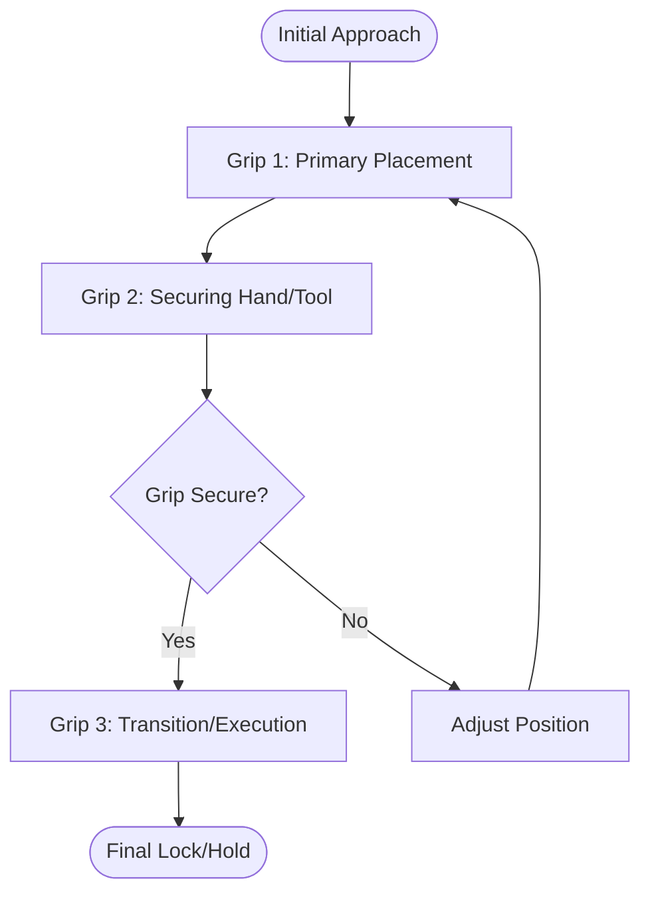
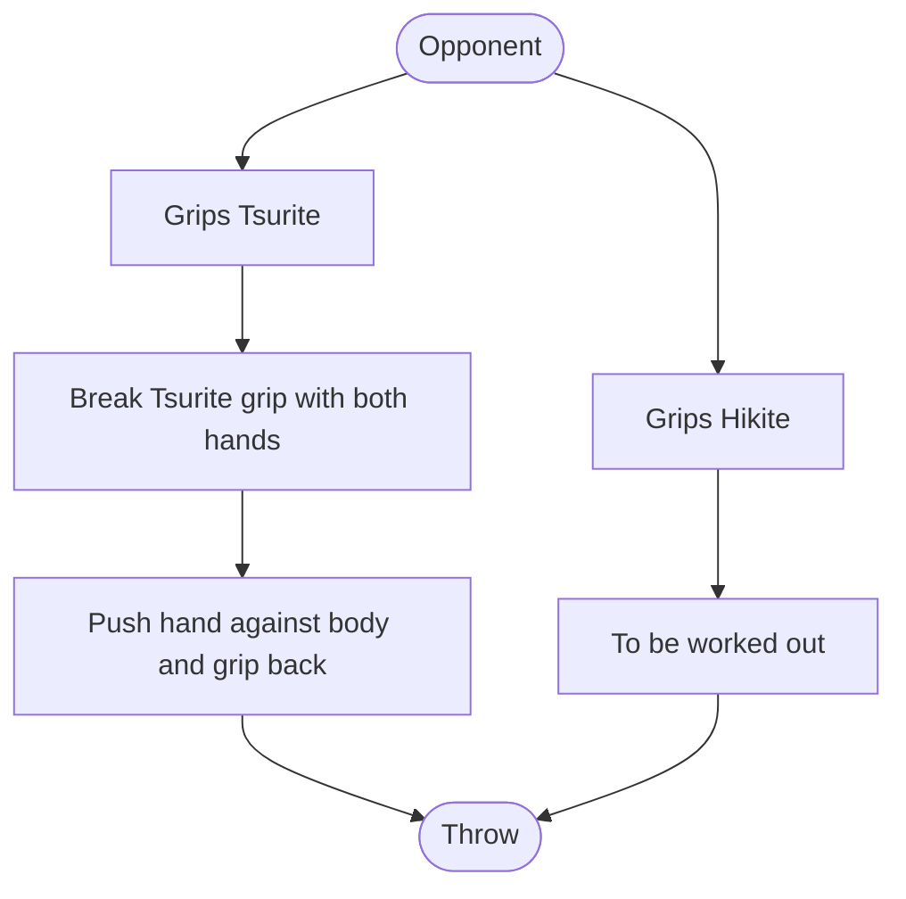

___
> Grip is the most important, without it you can't throw.

When I have neck grip and my opponent has a grip on the inside (distract and) push elbow down, to pull him closer!
# Variations
### Ai-yotsu (same-side)

### Kenka-yotsu (opposite-side)

